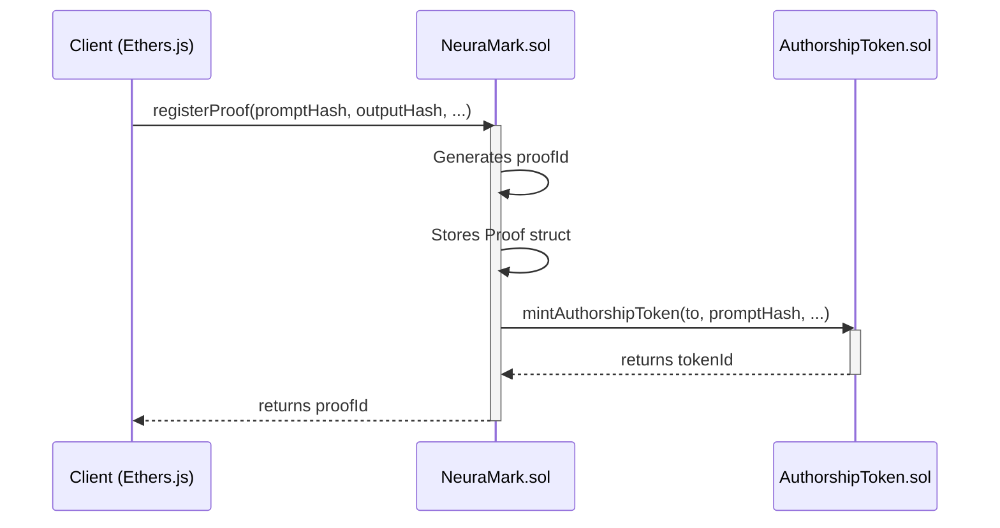

# NeuraMark Blockchain Backend

This document provides a comprehensive overview of the blockchain infrastructure for the NeuraMark proof-of-authorship verification system.

## Overview

The NeuraMark blockchain backend consists of two smart contracts deployed on the Ethereum Sepolia testnet. These contracts are responsible for the immutable, on-chain storage of AI content proof metadata.

-   **`NeuraMark.sol`**: The main smart contract for registering and verifying proofs.
-   **`AuthorshipToken.sol`**: An ERC-721 contract for minting soulbound NFT certificates of authorship.

## For Users

As a user of the NeuraMark platform, you don't need to interact directly with the smart contracts. All blockchain interactions are handled for you by the NeuraMark web application. When you register a proof, you will be prompted to sign a transaction with your MetaMask wallet, which will record the proof on the blockchain.

## For Developers

This section provides a technical deep-dive into the smart contracts, their functions, and how to interact with them from a client-side application.

### Contract Interaction Flow

The following diagram illustrates the typical flow of interaction between a client, the `NeuraMark` contract, and the `AuthorshipToken` contract during the proof registration process.



### Smart Contract API: `NeuraMark.sol`

#### Struct: `Proof`

This struct defines the data structure for a proof stored on the blockchain.

```solidity
struct Proof {
    address creator;      // Wallet address of the creator
    string promptHash;    // SHA-256 hash of the prompt
    string outputHash;    // SHA-256 hash of the AI output
    string modelInfo;     // AI model information (e.g., "GPT-4")
    string promptCID;     // IPFS CID for prompt content
    string outputCID;     // IPFS CID for output content
    uint256 timestamp;    // Block timestamp of registration
}
```

#### Functions

##### `registerProof`

Registers a new proof on-chain and triggers the minting of a corresponding soulbound NFT.

```solidity
function registerProof(
    string memory promptHash,
    string memory outputHash,
    string memory modelInfo,
    string memory promptCID,
    string memory outputCID
) public returns (bytes32)
```

-   **Parameters**:
    -   `promptHash`: The SHA-256 hash of the AI prompt.
    -   `outputHash`: The SHA-256 hash of the AI output.
    -   `modelInfo`: A string describing the AI model used.
    -   `promptCID`: The IPFS Content Identifier for the prompt.
    -   `outputCID`: The IPFS Content Identifier for the output.
-   **Returns**: The unique `proofId` (a `bytes32` value).
-   **Emits**: `ProofRegistered(bytes32 proofId, address creator, uint256 timestamp)`

##### `verifyProof`

Retrieves the details of a proof by its `proofId`.

```solidity
function verifyProof(bytes32 proofId) public view returns (Proof memory)
```

-   **Parameters**:
    -   `proofId`: The unique ID of the proof to retrieve.
-   **Returns**: A `Proof` struct containing the proof's details.
-   **Reverts**: If a proof with the given `proofId` does not exist.

##### `isProofRegistered`

Checks if a proof with a given `proofId` has been registered.

```solidity
function isProofRegistered(bytes32 proofId) public view returns (bool)
```

-   **Parameters**:
    -   `proofId`: The unique ID of the proof to check.
-   **Returns**: `true` if the proof exists, `false` otherwise.

### Client-Side Interaction (`ethers.js`)

Here are some examples of how to interact with the `NeuraMark` contract from a JavaScript/TypeScript application using `ethers.js`.

#### Connecting to the Contract

```javascript
import { ethers } from 'ethers';
import NeuraMarkAbi from './NeuraMark.json';

const provider = new ethers.BrowserProvider(window.ethereum);
const signer = await provider.getSigner();
const contractAddress = 'YOUR_CONTRACT_ADDRESS';
const neuraMarkContract = new ethers.Contract(contractAddress, NeuraMarkAbi, signer);
```

#### Registering a Proof

```javascript
async function registerNewProof(promptHash, outputHash, modelInfo, promptCID, outputCID) {
  try {
    const tx = await neuraMarkContract.registerProof(
      promptHash,
      outputHash,
      modelInfo,
      promptCID,
      outputCID
    );
    const receipt = await tx.wait();
    console.log('Transaction successful:', receipt);
    // Extract proofId from the event logs
    const proofId = receipt.logs[0].args[0];
    return proofId;
  } catch (error) {
    console.error('Error registering proof:', error);
  }
}
```

#### Verifying a Proof

```javascript
async function verifyExistingProof(proofId) {
  try {
    const proof = await neuraMarkContract.verifyProof(proofId);
    console.log('Proof details:', proof);
    return proof;
  } catch (error) {
    console.error('Error verifying proof:', error);
  }
}
```

### Quick Start

1.  **Install Dependencies**: `npm install`
2.  **Setup Environment Variables**: Create a `.env` file from `.env.example`.
3.  **Compile Contracts**: `npx hardhat compile`
4.  **Run Tests**: `npx hardhat test`
5.  **Deploy to Sepolia**: `npx hardhat ignition deploy ignition/modules/NeuraMark.ts --network sepolia`

### Project Structure

```
blockchain/
├── contracts/
│   ├── NeuraMark.sol
│   └── AuthorshipToken.sol
├── test/
│   └── NeuraMark.ts
├── ignition/
│   └── modules/
│       └── NeuraMark.ts
└── hardhat.config.ts
```
