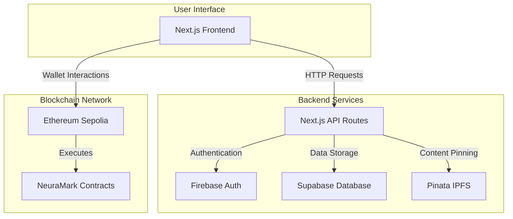
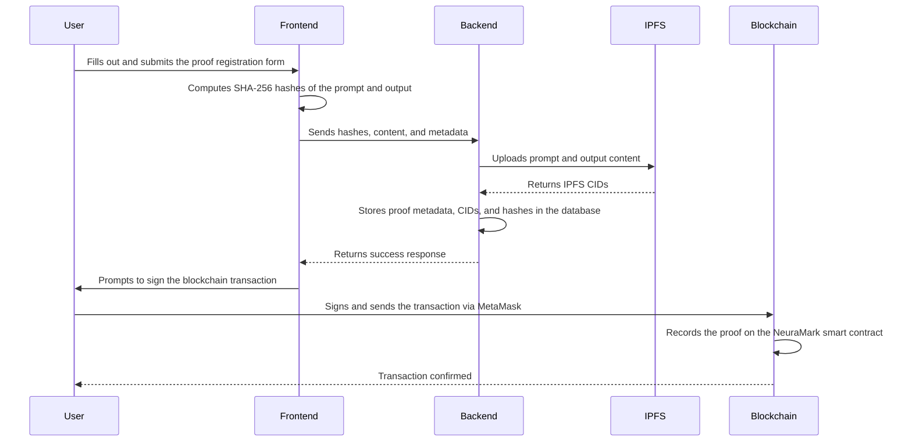

# NeuraMark Architecture

This document provides a detailed look into the technical architecture of the NeuraMark platform, from the frontend user interface to the decentralized backend infrastructure.

## High-Level System Architecture

The NeuraMark platform is designed as a modular, full-stack application that integrates modern web technologies with decentralized systems. The following diagram provides a high-level overview of the system's components and their interactions.

## Component Breakdown

### Frontend

The frontend is a modern, responsive web application built with **Next.js** and **React**. It is responsible for providing a seamless user experience for registering, viewing, and verifying proofs.

-   **Framework**: [Next.js](https://nextjs.org/) (v15) with the App Router
-   **UI Library**: [React](https://react.dev/) (v19)
-   **Styling**: [Tailwind CSS](https://tailwindcss.com/) with [shadcn/ui](https://ui.shadcn.com/) for component primitives
-   **Animations**: [Framer Motion](https://www.framer.com/motion/) for smooth, fluid animations
-   **Web3 Integration**: [Ethers.js](https://ethers.io/) for interacting with the Ethereum blockchain via MetaMask

### Backend

The backend is built using **Next.js API Routes**, which provide a serverless function environment for handling API requests.

-   **/api/register-proof**: Handles the registration of new proofs, orchestrating interactions with IPFS and the database.
-   **/api/verify-proof**: Retrieves proof data from the database and the blockchain.
-   **/api/user/***: Manages user-related operations, such as creating and updating user profiles.
-   **/api/wallet/***: Handles the linking and management of user wallets.
-   **/api/get-proofs**: Fetches proofs for the public explorer and user dashboards.

### Blockchain

The blockchain component is the core of the NeuraMark platform, providing the decentralized, immutable ledger for storing proof metadata.

-   **Network**: [Ethereum Sepolia Testnet](https://sepolia.etherscan.io/)
-   **Smart Contracts**:
    -   `NeuraMark.sol`: The main contract for registering and verifying proofs.
    -   `AuthorshipToken.sol`: An ERC-721 contract for minting soulbound NFT certificates.
-   **Development Environment**: [Hardhat](https://hardhat.org/)

### Database

A **PostgreSQL** database, hosted on [Supabase](https://supabase.com/), is used to store off-chain data that complements the on-chain proofs. This includes user profiles, wallet-to-user mappings, and cached proof metadata for faster retrieval.

-   **ORM**: [Prisma](https://www.prisma.io/) is used for database access and schema management.

### IPFS

**InterPlanetary File System (IPFS)** is used for decentralized, content-addressed storage of AI-generated content (prompts and outputs). [Pinata](https://pinata.cloud/) is used as a pinning service to ensure the data remains available on the IPFS network.

## Proof Registration Data Flow

The following sequence diagram illustrates the step-by-step process of registering a new proof on the NeuraMark platform.

This flow ensures that the user's raw content is stored decentrally on IPFS, while the immutable proof of authorship is recorded on the blockchain.
