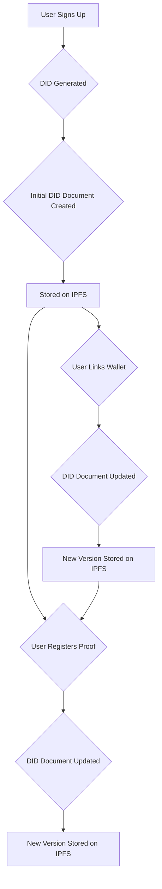

# Decentralized Identity (DID) in NeuraMark

NeuraMark features a robust Decentralized Identifier (DID) system, compliant with the W3C DID Core v1.0 specification. This system provides a unified, verifiable identity that links a user's Web2 and Web3 credentials.

## Unified Web2 + Web3 Identity

The NeuraMark DID system creates a seamless link between a user's Firebase account, their Ethereum wallets, and all of their registered proofs.

### Key Features

-   **W3C Compliant**: Adheres to the DID Core v1.0 specification for maximum interoperability.
-   **Auto-Generation**: A unique DID is automatically created for each user upon sign-up.
-   **Unified Identity**: A single DID links a user's Firebase UID, multiple wallet addresses, and all registered proofs.
-   **IPFS Storage**: DID documents are stored immutably on IPFS, ensuring data integrity and persistence.
-   **Public Verification**: Anyone can verify a DID via the `/verify-did` page.

### DID Format

The NeuraMark DID follows a simple, clear format:

```text
did:neuramark:<userId>
```

**Example**: `did:neuramark:abc123xyz456`

### DID Document Structure

The DID document is a JSON object that contains information about the DID, including the user's wallets and proofs.

```json
{
  "@context": "https://www.w3.org/ns/did/v1",
  "id": "did:neuramark:clx1234567890",
  "name": "User Display Name",
  "email": "user@example.com",
  "wallets": ["0x742d35Cc6634C0532925a3b844Bc9e7595f0bEb3"],
  "verifiedProofs": [
    {
      "proofId": "0x1a2b3c...",
      "ipfsCID": "QmX...",
      "model": "GPT-4",
      "timestamp": "2025-10-21T12:00:00.000Z",
      "txHash": "0xabc..."
    }
  ],
  "createdAt": "2025-10-21T10:00:00.000Z",
  "updatedAt": "2025-10-21T12:00:00.000Z"
}
```

## DID Lifecycle

The following diagram illustrates the lifecycle of a DID, from creation to updates.



This system ensures that a user's DID is a living document, always reflecting their current state on the NeuraMark platform.
