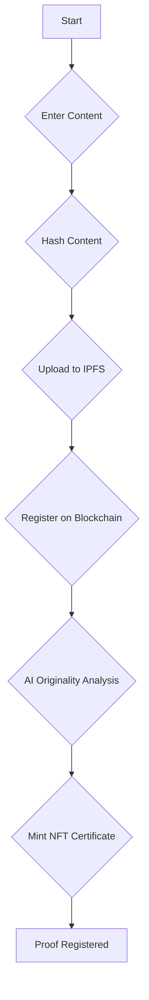

# How to Use NeuraMark

This guide provides a step-by-step walkthrough of the NeuraMark platform's functionalities, from creating an account to verifying a proof.

## 1. Create an Account

To get started, click the **"Sign In"** button in the navigation bar. You can create an account using:

-   **Google OAuth**: For a quick, one-click sign-in experience.
-   **Email/Password**: For a traditional email and password-based account.

Upon creation, your user profile is established in both Firebase and the NeuraMark database.

## 2. Link Your Wallet(s)

After you've signed in, you'll need to link an Ethereum wallet to your account.

1.  Navigate to your **Profile** page by clicking on your avatar.
2.  Click the **"Link Wallet"** button.
3.  Approve the connection request from MetaMask.

The first wallet you link will be designated as your primary wallet. You can link multiple wallets to a single account for greater flexibility.

## 3. Register a Proof

The following diagram illustrates the user flow for registering a new proof:

**Step 1: Enter Content**
-   **AI Prompt**: The prompt used to generate the content.
-   **AI Output**: The generated content (text, image, or code).
-   **Model Info**: The AI model used (e.g., GPT-4, DALL-E 3).
-   **Output Type**: Select the appropriate content type.

**Step 2: Hash Content**
-   The system computes SHA-256 hashes of your content on the client-side, ensuring your raw data remains private.

**Step 3: Upload to IPFS**
-   Your content is uploaded to the InterPlanetary File System (IPFS) via Pinata, creating a permanent, decentralized record.

**Step 4: Register on Blockchain**
-   Click the **"Register Proof"** button and approve the MetaMask transaction. This action requires a small amount of Sepolia ETH for gas fees.

**Step 5: AI Originality Analysis**
-   NeuraMark's integrated Gemini AI analyzes your content's originality against existing proofs, providing a uniqueness score.

**Step 6: Mint NFT Certificate**
-   A soulbound (non-transferable) ERC-721 token is automatically minted to your wallet, serving as an on-chain certificate of authorship.

## 4. Understanding Your Proofs

NeuraMark provides three complementary proof formats, each serving a different use case.

| Format                     | Purpose                 | Verification Method        | Portability            | Use Case                       |
| -------------------------- | ----------------------- | -------------------------- | ---------------------- | ------------------------------ |
| **Soulbound NFT**          | On-chain trophy         | Etherscan, OpenSea         | Ethereum-only          | Showcase blockchain ownership  |
| **W3C Verifiable Credential** | Digital passport        | Any W3C-compliant verifier | Platform-independent   | Present proofs to any service  |
| **PDF Certificate**        | Human-readable document | Visual QR scan             | Print/email-friendly   | Legal docs, portfolios         |

### Why Verifiable Credentials?

Unlike NFTs (which are tied to the Ethereum ecosystem) or PDFs (which lack cryptographic verification), W3C Verifiable Credentials are:

-   **Self-Sovereign**: You control your credentials, not the platform.
-   **Portable**: They work with any identity wallet, not just Ethereum wallets.
-   **Interoperable**: They use a standard JSON-LD format that is recognized globally.
-   **Cryptographically Signed**: Ed25519 signatures prove their authenticity.

## 5. Manage Your Profile

The `/profile` page allows you to:

-   View your account details.
-   Manage your linked wallets (add, remove, or set a primary wallet).
-   Sign out of your account.

## 6. View and Verify Proofs

-   **/dashboard**: View all of your registered proofs.
-   **/explorer**: Browse all public proofs on the NeuraMark platform.
-   **/verify**: Verify a proof by entering its unique ID.
-   **/verify-did**: Verify a user's decentralized identity.
-   **/verify-vc**: Verify a W3C Verifiable Credential.
